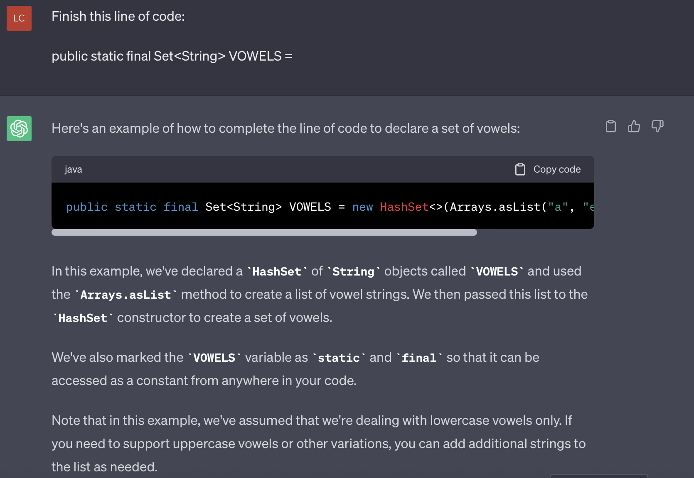

# Background 
### GPT-4:
In writing the 2030 essay, I opted for the help of OpenAi's largest and most powerful Large Language Model, GPT-4. It's worth noting that although it's an *incredibly* powerful tool that I considered unimaginable only a year ago, the general populace doesn't consider it worth the *$20* a month fee. 

Me? I'm surprised it's so cheap. 

My first introduction to it was during my first year at University. We were learning Java at the time and I remember being blown away by it's ability to answer any technical question with a  cohesive answer, reagrdless how awkward a query I fed it. If I didn't  understand, it could customise it to my exact way of learning. 

To understand why *ChatGPT (GPT-3.5)* was so revolutionary (["100M users after 2 months" revolutionary](https://www.theguardian.com/technology/2023/feb/02/chatgpt-100-million-users-open-ai-fastest-growing-app)), consider what we were working with before that. If you didn't understand something, you'd Google it. You'd spend a few minutes digesting information someone else wrote. You'd then spend time on constructing a new solution based on that new information. But ChatGPT wrapped that entire process up and served it to you through Natural Language. 

For assignments, I'd throw it some Java code and a mysterious error I had and *ChatGPT*  would concisely point out the error in my logic that caused my program to flip. But it **wasn't perfect**.

ChatGPT - *and even GPT-4* - had a limited *context window*. You could only have so long a conversation before it began to forget what you were on about *at the beginning* of the conversation. As well, you had to manually copy and paste your code into the chat interface. Not ideal.  

Granted, this was still infinitely better than scrolling down the depths of Reddit for hours, before finding that a random guy had your exact problem and solved it with a single line of code changed. 

It wasn't long before I began using it for other things as well. 

I gained invaluable insights on how to improve my GitHub, CV and Portfolio. It's helped write blogs for me for work. And it helped me study for my 1st Year Calculus exam. 

All of this is why it still shocks me how so few people are actively using GPT-3.5/4 as a primary tool in their daily lives. I think it boils down to the fact that this tool still requires a bit of creativity and Proompting (Prompt engineering lol) to get the best results. But what about when the models are so advanced, this won't be necessary? By the time my first essay's expiration rings around, I expect that to be the case. 

